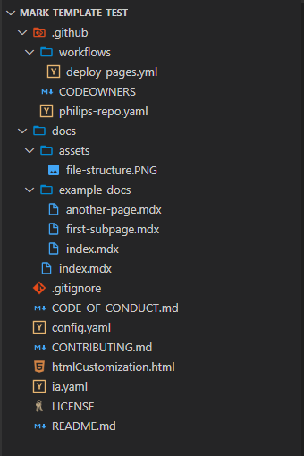

## Criação de repositórios que usam MARK

### Fontes de pesquisa

Clique [aqui](https://philips.stackenterprise.co/questions/2241?rq=1#openInNewTab) para ver o roteiro de criação de páginas usando o [MARK](https://www.dls.philips.com/app/mark/#openInNewTab) do Stackoverflow da Philips.

[Aqui](https://dls-infra.internal.philips/#dls-infra#openInNewTab) para informações do DLS-Infra.

E [aqui](https://continuous-compliance.philips-internal.com/rules#rules#openInNewTab) para ver as regras de *compliance*.

### Passo a Passo

Após ter o [MARK instalado](https://www.dls.philips.com/app/mark/setup-and-workflow/installation#nodejs-145#openInNewTab) na versão 0.25.1 (use `mark -V` para ver a versão instalada) siga os passos abaixo:

#### 1. Crie o repositório 

Crie o repositório no Github do philips-internal usando este [template](https://github.com/philips-internal/mark-template#openInNewTab). Basta clicar no botão verde "Use this template > Create a new Repository". Aí é só batizar e descrever a finalidade dele.

#### 2. Clone o repositório

Clone o repositório criado, criando uma pasta para o projeto e no terminal do VsCode rode, por exemplo:

```
git clone git@github.com:alexandranaomi/mark-template-test.git . 
```

Confira os remotes com:

```
$ git remote -v
origin  git@github.com:alexandranaomi/mark-template-test.git (fetch)
origin  git@github.com:alexandranaomi/mark-template-test.git (push)
```

#### 3. Run MARK

Use `mark serve config.yaml` para executar o MARK localmente e testar se está tudo OK.

#### 4. Crie o philips-repo.yaml

Na raiz do projeto (ou dentro da pasta .github) crie o arquivo [philips-repo.yaml](https://continuous-compliance.philips-internal.com/rules/89b2a779-0fab-423c-99b9-ed88d958f19d#description#openInNewTab):

```
# Business Category according to https://share.philips.com/sites/SWCoE/Lists/List%20of%20Business%20Categories/AllItems.aspx
# SWCoE - 62
business-category: 22

# Direct link to details business-category. Change the ID in the URL below.
business-category-details: https://share.philips.com/sites/SWCoE/Lists/List%20of%20Business%20Categories/DispForm.aspx?ID=22

####################################################################################################################
# Optional Fields                                                                                                  #
####################################################################################################################
# Template version
version: 1
```

Conforme a [lista de códigos](https://share.philips.com/sites/SWCoE/Lists/List%20of%20Business%20Categories/AllItems.aspx?sortField=ID&isAscending=true&viewid=bf5cc3e1%2D6fe3%2D4c0c%2D8e94%2D8c04c26a40a2#openInNewTab) "22 = EMR & CM" e "89 = Design XD".

#### 5. Crie o CODEOWNERS

Na raiz do projeto (ou dentro da pasta .github), crie o arquivo CODEOWNERS onde serão listados os validadores de PR. 

Exemplo do [emr-tokens](https://github.com/philips-internal/emr-tokens/blob/dev/.github/CODEOWNERS#openInNewTab):

```
* @philips-internal/emr-designtech-admins

.github/ @philips-internal/alfred
packages/emr-tokens-variables/build/ @philips-internal/alfred
packages/emr-tokens-demo-app/ @philips-internal/alfred
package.json  @philips-internal/alfred
.nvmrc  @philips-internal/alfred
.npmrc  @philips-internal/alfred
.release-it.json @philips-internal/alfred
```

Exemplo do [OSPO](https://github.com/philips-internal/OSPO/blob/main/CODEOWNERS#openInNewTab):

```
# These owners will be the default owners for everything in
# the repo. Unless a later match takes precedence,
# they will be requested for review when someone opens a pull request.
*          @philips-internal/ospo-core

# See CODEOWNERS syntax here: https://help.github.com/articles/about-codeowners/#codeowners-syntax
```

#### 6. Solicite domínio `*.philips-internal.com`

Solicite um domínio `*.philips-internal.com` abrindo uma issue [aqui](https://github.com/philips-internal/request-philips-internal-pages#openInNewTab)

#### 7. Solicite acessos ao DLS-Infra

Solicite acessos ao [DLS-Infra](https://dls-infra.internal.philips/how-to/access#access#openInNewTab) e ao [Philips Runner](https://dls-infra.internal.philips/how-to/request-philips-runners#request-philips-runner#openInNewTab) para rodar as *__actions__*.

#### 8. Crie workflows no Github Actions

Dentro da pasta .github, crie uma pasta workflows para armazenar os [workflows](https://www.dls.philips.com/app/mark/setup-and-workflow/setting-up-github-actions#about-github-actions#openInNewTab) do Github Actions do projeto.

Exemplo do `deploy-pages.yml` do [continuous-compliance](https://github.com/philips-internal/continuous-compliance/blob/main/.github/workflows/deploy-pages.yml#openInNewTab) para o *__deploy__* no Github Pages:

```
name: GH Pages deployment
on:
  push:
    paths:
      - ia.yaml
      - config.yaml
      - docs/**
      - .github/workflows/deploy-pages.yml
    branches:
      - main
jobs:
  # This is the 'setup' job that uses the 'utils' Mark action's output.
  setup:
    name: Setup
    runs-on: [self-hosted, philips, linux, x64]
    # Make use of the action outputs.
    outputs:
      ISSUE_NUMBER: ${{ steps.utils.outputs.ISSUE_NUMBER }}
      COMMIT_SHA: ${{ steps.utils.outputs.COMMIT_SHA }}
    steps:
      - id: utils
        name: Run Mark action
        uses: philips-internal/mark/packages/actions/utils@87281471804e6979a54a402c54f9efc5bbd73288 # ratchet:philips-internal/mark/packages/actions/utils@v0.25.1
        with:
          token: ${{ secrets.GITHUB_TOKEN }}
  # Actual deployment action. It needs the setup to run first, grabs its output and sets it as environment variables.
  deploy:
    name: Deploy
    runs-on: [self-hosted, philips, linux, x64]
    needs:
      - setup
    env:
      ISSUE_NUMBER: ${{ needs.setup.outputs.ISSUE_NUMBER }}
      COMMIT_SHA: ${{ needs.setup.outputs.COMMIT_SHA }}
    steps:
      - name: Setup NodeJS
        uses: actions/setup-node@8c91899e586c5b171469028077307d293428b516 # v3.5.1
        with:
          node-version: '14'
      - name: Checkout
        uses: actions/checkout@755da8c3cf115ac066823e79a1e1788f8940201b # v3.2.0
        with:
          ref: ${{ env.COMMIT_SHA }}
      - name: Deploy
        uses: philips-internal/mark/packages/actions/deploy@87281471804e6979a54a402c54f9efc5bbd73288 # ratchet:philips-internal/mark/packages/actions/deploy@v0.25.1
        with:
          token: '${{ secrets.GITHUB_TOKEN }}'
          pat: '${{ secrets.GITHUB_TOKEN }}'
          mark-input: config.yaml
          mark-version: '^0.25.1'
          github-pages-url: https://continuous-compliance.philips-internal.com
          github-pages-email: jeroen.knoops@philips.com
          github-pages-branch: gh-pages
          deploy-url: https://continuous-compliance.philips-internal.com
          environment-name: github-pages
```
OBS: alterar os 4 últimos campos *__github-pages__* e o *__deploy-url__*.

### Estrutura


