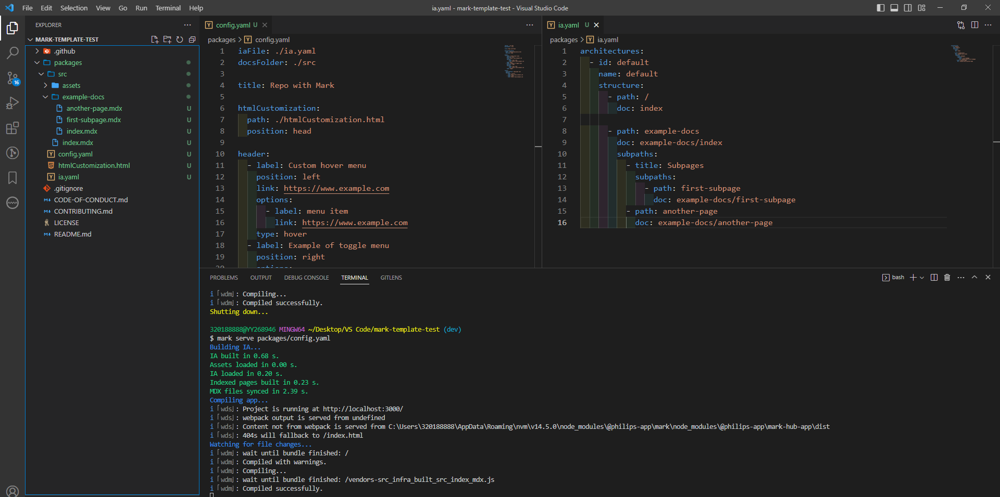

## Rodar o MARK com arquivos em uma subpasta

### Subpasta `packages` 

A subpasta `packages`, por exemplo, deve ser criada na raiz do projeto.

Os arquivos `config.yaml`, `ia.yaml` e `htmlCustomization.html` devem estar na raiz da subpasta `packages`.

Dentro da subpasta `packages` deve ser criada a pasta `docs`.

### Pasta `docs`

A pasta `docs` que contém os arquivos `.mdx`, pode ter outro nome, por exemplo `src`.

No `config.yaml` o novo nome deve ser indicado no campo `docsFolder`:

```
docsFolder: ./src
```

O campo `docsFolder` já tem como padrão a pasta `./docs`, portanto se não mudar o nome não precisa nem indicá-lo.

### Arquivo `config.yaml`

O `config.yaml` passa a ser obrigatório. Não foi possível rodar o MARK apenas com o `ia.yaml`. Ele deve ter esta estrutura/caminhos:

```
iaFile: ./ia.yaml
docsFolder: ./src

htmlCustomization:
  path: ./htmlCustomization.html
  position: head
```

Mesmo que os arquivos estejam dentro da subpasta `packages` o caminho não se altera, ou seja, não precisa colocar, por exemplo `../packages/ia.yaml`.

### Rodar o MARK

Para rodar o MARK use o comando:

```
mark serve packages/config.yaml
```

### Estrutura

